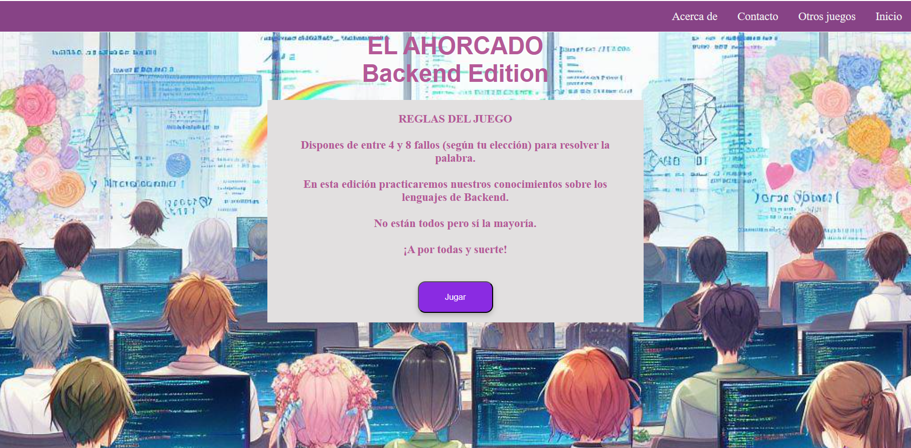

# P7 JUEGO DEL AHORCADO   

# 🎮 El juego del ahorcado. Backend Edition

El propósito de este proyecto es la creación de una versión del juego clásico “ El Ahorcado”, utilizando PHP como lenguaje de programación principal. Este juego no hará uso de bases de datos. 

El juego permitirá a un jugador intentar descifrar una palabra que se encuentra oculta, proporcionando una representación visual de su progreso y llevando un registro de los intentos que ha realizado.

Este proyecto es un ejemplo de desarrollo web en el que la lógica del juego se ejecuta en el servidor. Es decir, todas las decisiones y cálculos se realizan en el servidor, no en el navegador del usuario.
Cuando el usuario realiza una acción, como adivinar una letra, esta información se envía al servidor a través de un formulario web. El servidor procesa esta información, actualiza el estado del juego según corresponda y luego envía una respuesta al cliente. Esta respuesta puede incluir una actualización de la representación visual del juego, un mensaje indicando si el intento fue correcto o incorrecto, o incluso un mensaje indicando que el juego ha terminado.

En este juego, el listado de palabras son leguajes de programación de backend, para que el jugador compruebe los conocimientos que tiene sobre ello. 

## 📝 Requisitos funcionales

- Inicio del juego:
  - El juego tiene que comenzar con la selección aleatoria de una palabra oculta de una lista predefinida.
  - La palabra oculta se debe mostrar en la interfaz como una serie de guiones bajos representando cada letra.
- Jugabilidad:
  - El usuario puede ingresar una letra en cada intento. Tiene de 4 a 8 itentos según su selección.
  - El sistema debe validar si la letra ingresada está en la palabra oculta y actualizar la interfaz en consecuencia.
  - Se deben manejar y mostrar los intentos restantes.
- Finalización del juego:
  - El juego tiene que terminar cuando el usuario haya adivinado la palabra o se quede sin intentos.
  - Se debe mostrar un mensaje indicando si el usuario ganó o perdió.
  - Se puede permitir la opción de reiniciar el juego.

## 💡 Extras

- Interfaz mejorada:
  - Utilización de estilos CSS y JS para mejorar la presentación del juego.

## RESULTADO FINAL
  

## 💻 Tecnologías Utilizadas

## 🚀 Cómo ejecutar el juego

### Modo local

Para ejecutar el juego en modo local, necesitas tener instalado un servidor web como Apache, Nginx o XAMPP, y PHP 7.4 o superior.

- Clona o descarga el repositorio en tu equipo.
- Copia la carpeta del proyecto en el directorio raíz de tu servidor web (por ejemplo, htdocs o www).
- Abre un navegador web y accede a la URL http://localhost/nombre-del-proyecto, donde nombre-del-proyecto es el nombre de la carpeta del proyecto.
- Disfruta del juego.

### Modo servidor web

Para ejecutar el juego en un servidor web, necesitas tener acceso a un alojamiento web que soporte PHP 7.4 o superior.

- Clona o descarga el repositorio en tu equipo.
- Sube la carpeta del proyecto al directorio público de tu alojamiento web (por ejemplo, public_html o www).
- Abre un navegador web y accede a la URL http://tu-dominio.com/nombre-del-proyecto, donde tu-dominio.com es el dominio de tu alojamiento web y nombre-del-proyecto es el nombre de la carpeta del proyecto.
- Disfruta del juego.

## 🤝 Contribuciones

Las contribuciones son bienvenidas. Si tienes alguna sugerencia para mejorar el juego, por favor abre un issue o un pull request.

## 📜 Licencia

Este proyecto está licenciado bajo los términos de la licencia MIT. Esto significa que puedes usar, copiar, modificar y distribuir el código libremente, siempre que reconozcas la autoría original y no lo uses con fines comerciales.

## 👩‍💻 Autora

[Helena de Rosa](https://github.com/HelenaDR84)
